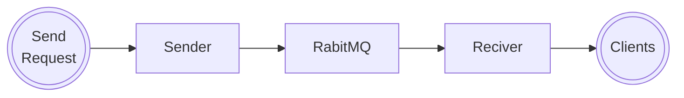

# Microservice based robust HTML Email Sender solution

This repository is an example of how a [microservice](https://en.wikipedia.org/wiki/Microservices) architecture can be implemented.
It's a simple solution with a single endpoint that expect an HTML email which will be sent to a list of recipients.

## The architecture



### The sender

The sender is a simple [Node.js](https://nodejs.org/en/) application that expose a single endpoint `/send` which expect a JSON body with the following structure:

```json
{
  "to": "example@example.com",
  "from": "My App",
  "subject": "Example Email",
  "text": "Plain text if you don't need HTML",
  "html": "<h1>Syntactically correct HTML code<h2>"
}
```

Make a `POST` request to `/send` route with an object or an array of objects defined above.

See the sender [README](packages/sender/README.md) for more details.

### RabbitMQ

[RabbitMQ](https://www.rabbitmq.com/) is a message broker that will be used to queue the emails to be sent. It's a very simple and fast solution to implement a queue system.
This ensures that failing services will not affect the email sending process. 

If a service dies or is overloaded, the emails will be queued and sent when the service is back online.

### The reciver

The reciver is a simple [Node.js](https://nodejs.org/en/) application that will consume the messages from the queue and send the emails with [Nodemailer](https://nodemailer.com/about/).

See the reciver [README](packages/reciver/README.md) for more details.